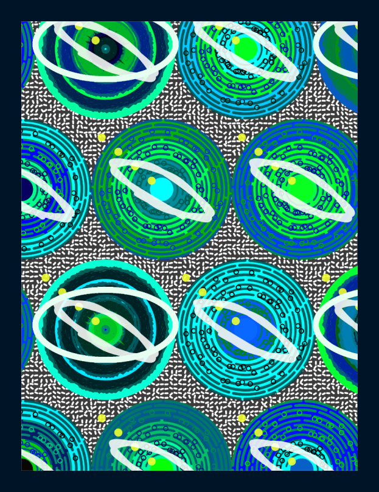
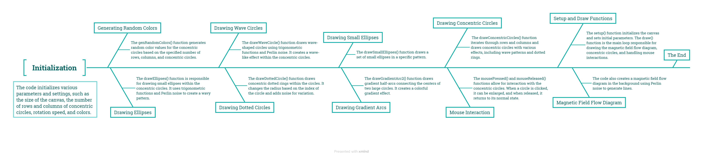
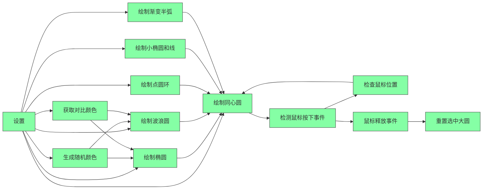
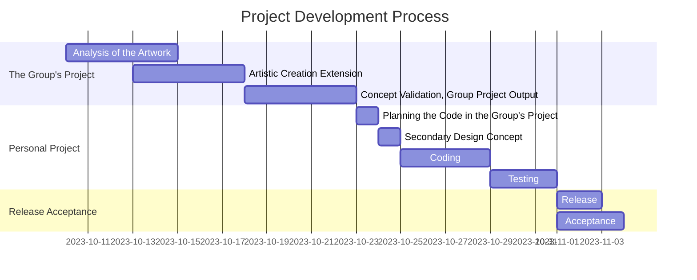

# 9103-FINAL-xihu0325

Static presentation of the final effect of the project

## 1.1 Introduction

In the complex tapestry of time and space, each individual is unique and independent. Although we may appear similar, our experiences are vastly different. In the same span of years, some may only taste the bitterness of life, while others savor its sweetness. Some struggle to survive and persevere, while others strive to break free from the constraints of the world. Despite the seemingly calm lives of most, beneath the surface, each person's destiny is like hidden undercurrents in the sea, always stirring different highs and lows. Under the tranquil facade, what is actually submerged is a life filled with tumultuous waves.

This design is a reinterpretation of Parsita Abad's work "Wheel of Fate." The color scheme is based on the Earth's blue, green, and white, emphasizing that while we all inhabit this same planet, each person's life story is unique. The design aims to provoke deep reflection and prompt individuals to seek the connection between their own lives and those of others.

In terms of shape, the design combines eyes with planets. Eyes are often regarded as the windows to emotions and inner worlds, the seat of the soul, and the gateway to the mind. By combining the shape of eyes with planets, the design implies the connection between each person's inner world and the universe.

The design retains the basic graphic elements and tone of "Wheel of Fate," seeking to use simple shapes to represent the different colors in each person's life. At the same time, it undertakes a secondary creation to delve deeper into the theme, aiming to trigger deep thought and emotional resonance. Choosing to view different Wheels of Fate, intends to stimulate contemplation of the resonance and connection between individuals and their own lives.

## 1.2 How To USE
**PS**：In ancient China, people believed that everyone's destiny was predetermined. Even though life paths may seem similar, they were actually quite different. It's similar to the stars in the sky—while they may appear the same, a closer look reveals that each star is a unique individual, diligently following its own trajectory.Click to view different ，**Let's together search for our own Wheels of Destiny.**。

- Follow the path ：                      `Move your mouse`
- Zoom in and read the Wheel of Destiny.：`Mouse click the circle`
- Change colors：                         `Refresh the page`

## 2.1 Iteration Process Record Table

| Iteration      | Address   |  Modify and add  |
| :--------  | :-----  | :----:  |
| Iteration1|https://github.com/xihu0325/9103-FINAL-xihu0325/blob/cdc167aca8595ebf6f941672a3d685a473ab02f0/9103%20final/sketch-1.js |Change colors, edit settings within the circles, and remove unnecessary code.|
| Iteration2 | https://github.com/xihu0325/9103-FINAL-xihu0325/blob/cdc167aca8595ebf6f941672a3d685a473ab02f0/9103%20final/sketch-2.js|Add Perlin noise effects, edit the background, apply Perlin noise effects within the circles, modify the color scheme, and adjust the data.|
| Iteration Final | https://github.com/xihu0325/9103-FINAL-xihu0325/blob/cdc167aca8595ebf6f941672a3d685a473ab02f0/9103%20final/sketch-final.js |Add mouse interaction, click to zoom in on the gears, track the mouse's path, and introduce elements into the scene to create as many possibilities as possible.|

## 2.2 Flow Chart

## 3.1 Project Editing Timeline (Timeline of Project Edits)

