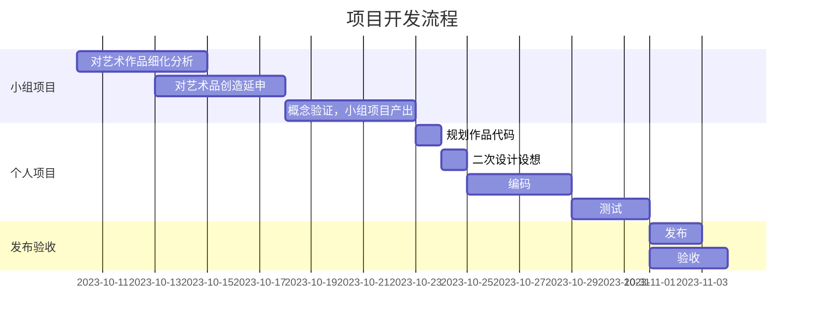

# 9103-FINAL-xihu0325
9103-Assignments-Creative coding major project
### 8. 绘制表格
| 迭代      | 地址   |  修改与添加  |
| :--------  | :-----  | :----:  |
| 迭代1|https://github.com/xihu0325/9103-FINAL-xihu0325/blob/cdc167aca8595ebf6f941672a3d685a473ab02f0/9103%20final/sketch-1.js |改颜色，圈内部的设置，删除多余代码|
| 迭代2 | https://github.com/xihu0325/9103-FINAL-xihu0325/blob/cdc167aca8595ebf6f941672a3d685a473ab02f0/9103%20final/sketch-2.js|添加柏林噪音效果，做背景，圆圈内添加柏林噪音效果，修改色调，调整数据|
| 迭代最终 | https://github.com/xihu0325/9103-FINAL-xihu0325/blob/cdc167aca8595ebf6f941672a3d685a473ab02f0/9103%20final/sketch-final.js |添加鼠标交互，点击放大齿轮，跟踪鼠标轨迹，给画面添加元素意图尽可能的创造更多的可能性|

### 9. 更详细语法说明

